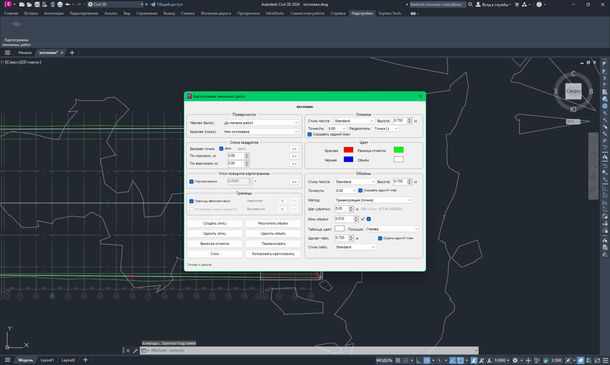
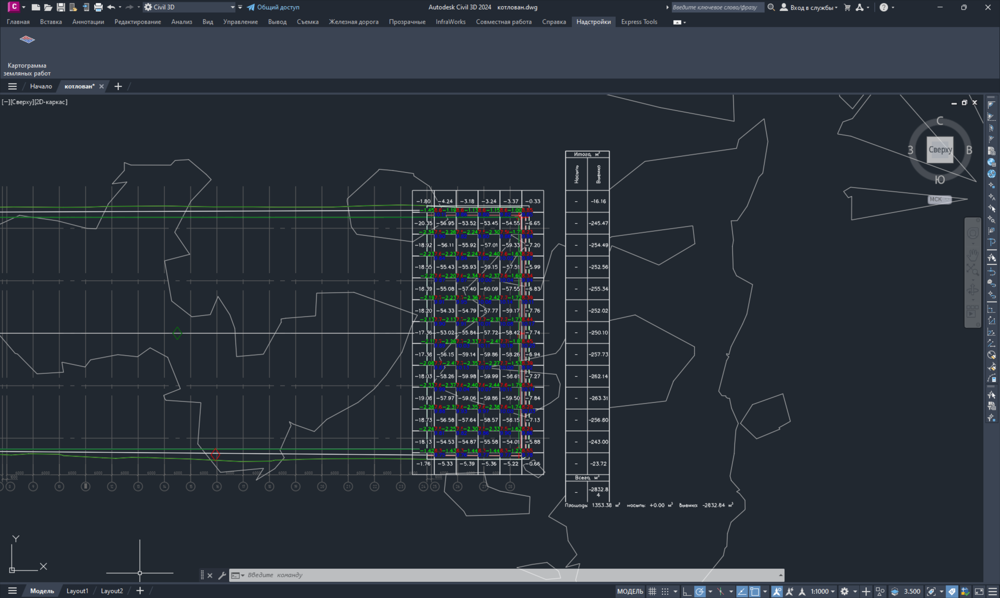

<div align="center">


# openkartogramma

**Earthworks cut/fill cartogram for AutoCAD Civil 3D**

[Русский](README.md) · [**English**](README.en.md)

[](https://github.com/zaycsev/openkartogramma/releases/latest)
[](https://github.com/zaycsev/openkartogramma/releases)
[](LICENSE)
[](https://github.com/zaycsev/openkartogramma)

</div>

---

**openkartogramma** is a plugin for **AutoCAD Civil 3D** that builds an earthworks
cartogram: a square grid laid between two surfaces (existing and design), with
per-node elevations, per-cell cut/fill volumes, and a summary table — fully
inside your drawing, ready for documentation.

It works on **Civil 3D 2015–2026** (the installer ships both a .NET Framework 4.8
build for 2015–2024 and a .NET 8 build for 2025+), installs per-user without
administrator rights, and is driven from a single dialog opened by the
`OpenKartogramma` command or the ribbon button on the **Add-ins** tab.

## Screenshots

| Plugin interface | Built cartogram |
|:---:|:---:|
|  |  |


## Features

### Grid & geometry
- **Square grid between two surfaces** — pick the *black* (existing) and *red*
  (design) Civil 3D surfaces; the grid is generated over their overlap.
- **Cell size** — independent X and Y spacing (default **1.00 × 1.00 m**), or pick
  the size directly on the drawing with two points.
- **Base point** — automatic, or pick a custom origin for the grid.
- **Rotation** — arbitrary angle, or snap the grid horizontally.
- **Boundaries** — automatic extents, or a manual outer boundary; add inner
  "holes" (closed regions where the grid is *not* drawn). Optionally **do not clip**
  the cells at the boundary.

### Elevations (labels)
- Per grid node the plugin writes three figures:
  - **black elevation** — existing surface,
  - **red elevation** — design surface,
  - **work elevation** — the difference (cut / fill).
- Configurable **text style**, **height**, **precision**, **decimal separator**,
  and a **background mask** toggle for readability.
- **Callout labels** — move a triple of labels to a clearer spot without losing
  the link to its cell.

### Volumes
- Per-cell **cut/fill volume** with two calculation methods:
  - **Triangulation** — sub-triangle integration of the surfaces (most accurate),
  - **Squares** — the classic `S × (h1+h2+h3+h4) / 4` manual method.
- **Sub-grid step** for accurate boundary-cell volumes.
- **Minimum volume** threshold to suppress negligible values.
- Independent **text style / height / precision** for volume labels.

### Summary table
- Automatic **totals table** (cut, fill, balance), with selectable **position**
  (top / bottom / left / right), **font height**, **text style**, **colour** and
  background mask.

### Styling & layers
- Per-category **colours** (AutoCAD ACI) for existing, design, work, volume and table.
- **Seven configurable layers** — rename any of them in the *Layers* dialog.
- **Redraw** — refresh colours, heights and styles in place, without a full rebuild.

### Workflow helpers
- **Create grid / Delete grid**, **Calculate volume / Delete volume**.
- **Copy cartogram** — selects every object the plugin created and copies it to the
  clipboard with a base point (`Ctrl+Shift+C`).
- **Persistent settings** — your preferences (sizes, heights, colours, styles,
  precision, volume method, …) are saved and restored across AutoCAD restarts.
- **Update check** — the *Layers* dialog links straight to the Releases page.

## Installation

1. Download `Setup_openkartogramma_v1.1.1.exe` from the
   [latest release](https://github.com/zaycsev/openkartogramma/releases/latest).
2. Close AutoCAD Civil 3D, run the installer, click **Next → Install → Finish**.
   The plugin installs to `%APPDATA%\Autodesk\ApplicationPlugins\` — no administrator
   rights required.
3. Start Civil 3D. The plugin loads automatically.

The installer detects your Civil 3D version and deploys the matching build
(.NET Framework 4.8 for 2015–2024, .NET 8 for 2025+).

## Usage

- Type **`OpenKartogramma`** on the command line, **or** click the button on the
  **Add-ins** ribbon tab.
- Choose the existing and design surfaces, set the grid and label options, then
  **Create grid** → **Calculate volume**.

## Uninstall

Control Panel → *Programs and Features* → **Картограмма земляных работ** → Uninstall.

## Building from source

Requirements: **.NET SDK 8+**, and an installed **AutoCAD / Civil 3D** (for the
reference assemblies).

```powershell
# both runtime builds + the installer (auto-detects Civil 3D and Inno Setup)
.\build-installer.ps1 -Version "1.1.1"
```

The project targets `net48` and `net8.0-windows`; AutoCAD/Civil 3D managed
assemblies are referenced from the installed product and never redistributed.

## License

Released under the **GNU General Public License v3.0**, with an additional
permission (GPLv3 §7) allowing linking against the proprietary Autodesk
AutoCAD / Civil 3D runtime libraries. See [LICENSE](LICENSE) for the full text.
