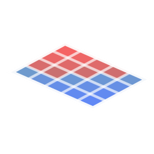

<div align="center">



# openkartogramma

**Картограмма земляных работ для AutoCAD Civil 3D**

[**Русский**](README.md) · [English](README.en.md)

[](https://github.com/zaycsev/openkartogramma/releases/latest)
[](https://github.com/zaycsev/openkartogramma/releases)
[](LICENSE)
[](https://github.com/zaycsev/openkartogramma)

</div>

---

**openkartogramma** — плагин для **AutoCAD Civil 3D**, который строит картограмму земляных работ: сетку квадратов между двумя поверхностями, существующей и проектной, с отметками в узлах, объёмами выемки или насыпи и итоговой таблицей готовой для оформления.

Работает в **Civil 3D 2015–2026** (установщик содержит сборку под .NET Framework 4.8 для 2015–2023 и под .NET 8 для 2024+), ставится для текущего пользователя без прав администратора и запускается из одного окна, открываемого командой `OpenKartogramma` или кнопкой на ленте во вкладке **Надстройки**.

## Скриншоты

|Интерфейс плагина|Готовая картограмма|
|:-:|:-:|
|[](https://github.com/zaycsev/openkartogramma/blob/main/docs/screenshot-ui-1.png)|[](https://github.com/zaycsev/openkartogramma/blob/main/docs/screenshot-result.png)|


## Функционал

### Сетка и геометрия

- **Сетка квадратов между двумя поверхностями** — выбираете _чёрную_ (существующую) и _красную_ (проектную) поверхности Civil 3D; сетка строится по их пересечению.
- **Размер ячейки** — независимо по X и Y, либо указывается на чертеже двумя точками.
- **Базовая точка** — автоматически или указанием своей точки начала сетки.
- **Поворот** — выравнивание сетки горизонтально.
- **Границы** — автоматические габариты по наложению поверхностей или выбор границы в пределах замкнутой полилинии по периметру и внутренние внутрених пустот указывая замкнутой полилиней области где стека квадратов не рисуется. 
  Опция **не обрезать** ячейки по границе влияет исключительно на визуальный вид  квадратов сетки оказавшихся на заданных границах  

### Отметки

- В каждом правом нижнем углу сетки квадратов выводятся три значения:
    - **чёрная отметка** — существующая поверхность,
    - **красная отметка** — проектная поверхность,
    - **рабочая отметка** — разница (выемка / насыпь).
- Настраиваемые **стиль текста**, **высота**, **точность**, **разделитель дробной части** и **скрытие заднего плана** для читаемости.
- **Выноска отметок** — перенос всех трех отметок в читаемое место в случае перекрытия отметок с сохранением привязки с изначальному местоположению отметок  .

### Объёмы

- **Объём выемки/насыпи по ячейке** двумя методами:
    - **Триангуляция** — построение треугольной сетки учитывая исходный рельефа поверхности, 
    - **Квадраты** — классический ручной метод `S × (h1+h2+h3+h4) / 4`.
- **Шаг субсетки** - шаг построения сетки для вычисления объёма в сответствии с выбранным методом влияет за масштаб учёта исходного рельефа.
- Порог **минимального объёма** — отсечение незначимых значений.
- Независимые **стиль / высота / точность** подписей объёмов.

### Итоговая таблица

- Автоматическая **таблица итогов** выемка, насыпь 
  с выбором **позиции* сверху / снизу / слева / справа,
   **высоты шрифта**, **стиля текста**, **цвета** и скрытие заднего плана итоговой таблицы .

### Оформление и слои

- **Цвета**  по категориям: чёрная, красная, рабочая, объём, таблица.
- **Семь настраиваемых слоёв** — переименовываются в диалоге _Слои_ ,
  так жев окне _слои_ ссылка на страницу релизов.
- **Перерисовать** — обновление цветов, высот и стилей на месте, без полной перестройки.

### Рабочие операции

- **Создать сетку / Удалить сетку**, **Рассчитать объём / Удалить объём**.
- **Копировать картограмму** — выделяет все созданные плагином объекты и копирует их в буфер с базовой точкой (`Ctrl+Shift+C`).
- **Постоянные настройки** — предпочтения (размеры, высоты, цвета, стили, точность, метод расчёта объёма, …) сохраняются и восстанавливаются между перезапусками AutoCAD.

## Установка

1. Скачайте `Setup_openkartogramma_v1.1.1.exe` из [последнего релиза](https://github.com/zaycsev/openkartogramma/releases/latest).
2. Закройте AutoCAD Civil 3D, запустите установщик, нажмите **Далее → Установить → Готово**. Плагин ставится в `%APPDATA%\Autodesk\ApplicationPlugins\` — права администратора не нужны.
3. Запустите Civil 3D. Плагин загрузится автоматически.

Установщик определяет версию Civil 3D и разворачивает подходящую сборку (.NET Framework 4.8 для 2015–2024, .NET 8 для 2025+).

## Запуск

- Введите команду **`OpenKartogramma`**, **или** нажмите кнопку на ленте во вкладке **Надстройки**.
- Выберите существующую и проектную поверхности, задайте параметры сетки и отметок, затем **Создать сетку** → **Рассчитать объём**.

## Удаление

Панель управления → _Программы и компоненты_ → **Картограмма земляных работ** → Удалить.

## Сборка из исходников

Требуется: **.NET SDK 8+** и установленный **AutoCAD / Civil 3D** (для ссылочных сборок).

```powershell
# обе сборки + установщик (авто-поиск Civil 3D и Inno Setup)
.\build-installer.ps1 -Version "1.1.1"
```

Проект собирается под `net48` и `net8.0-windows`; управляемые сборки AutoCAD/Civil 3D берутся из установленного продукта и никогда не распространяются вместе с плагином.

## Лицензия

Распространяется по **GNU General Public License v3.0** с дополнительным разрешением (GPLv3 §7), допускающим линковку с проприетарными библиотеками рантайма Autodesk AutoCAD / Civil 3D. Полный текст — в файле [LICENSE](https://github.com/zaycsev/openkartogramma/blob/main/LICENSE).
